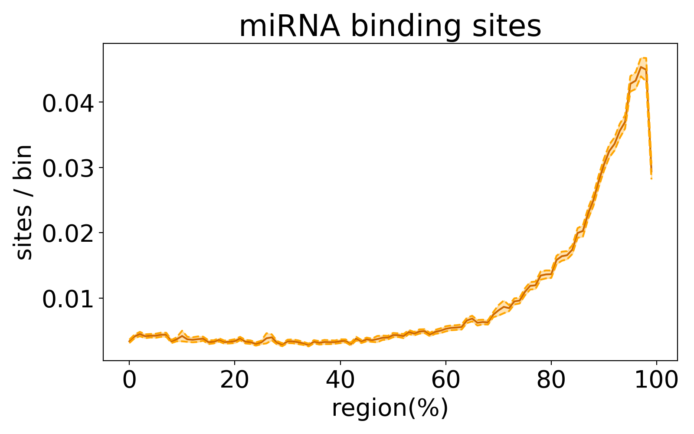

# RNA-seq Read Distribution Toolkit (RDT)

RDT is a toolkit to analyze RNA-seq reads and plot result into multiple ways include: 

- Read counts or binding sites density distribution in  three region (5'UTR, CDS, 3'UTR).


- Read counts or binding sites distribution near Start or Stop codons.


- Metagene distribution with customized datasets. 


- Fold-change between wild-type and mutant RNAs.


For more information, please check following paper:  
- [Transcriptome-wide analysis suggests piRNAs preferentially recognize the coding region of mRNAs in C. elegans, Wei-Sheng Wu, Jordan S. Brown, bioRxiv, 2022](https://www.biorxiv.org/content/10.1101/2022.06.08.495319v1)

## Getting Start
```sh
# download this project
git clone https://github.com/RyanCCJ/RDT.git
cd RDT

# analyze a dataset and generate metadata
python rdt-analyze.py --mode metagene --type RNAup --data examples/data/data1.csv --level site --output metadata

# plot metadata with all mRNAs or specific transcript list
python rdt-plot.py --input metadata --output metagene.png --title "miRNA binding sites"
```
### example


## Documentation

To see full documentation, please check this project's [wiki](https://github.com/RyanCCJ/RDT/wiki).

## Requirements
- Python >= 3.6
- numpy >= 1.12.1
- seaborn >= 0.9
- matplotlib >= 2.2.2
- pandas >= 0.23.0
- scipy >= 1.1.0
- PyYAML = 6.0
- statannot = 0.2.3
