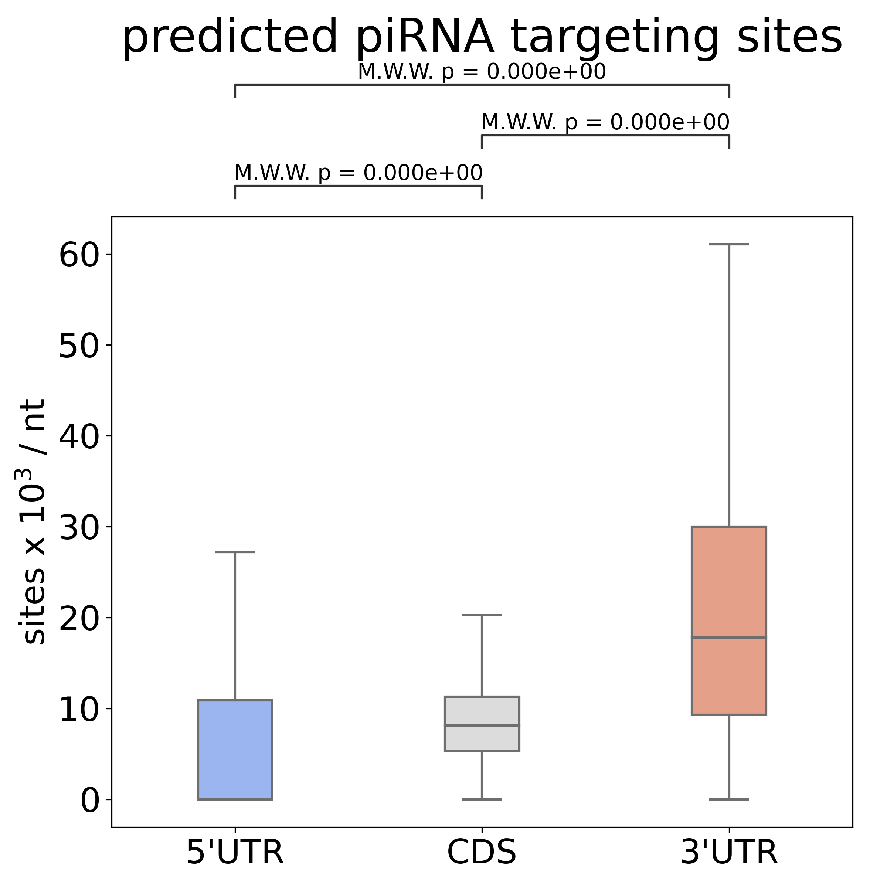
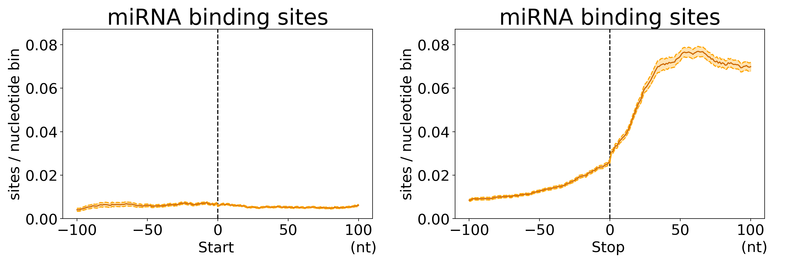
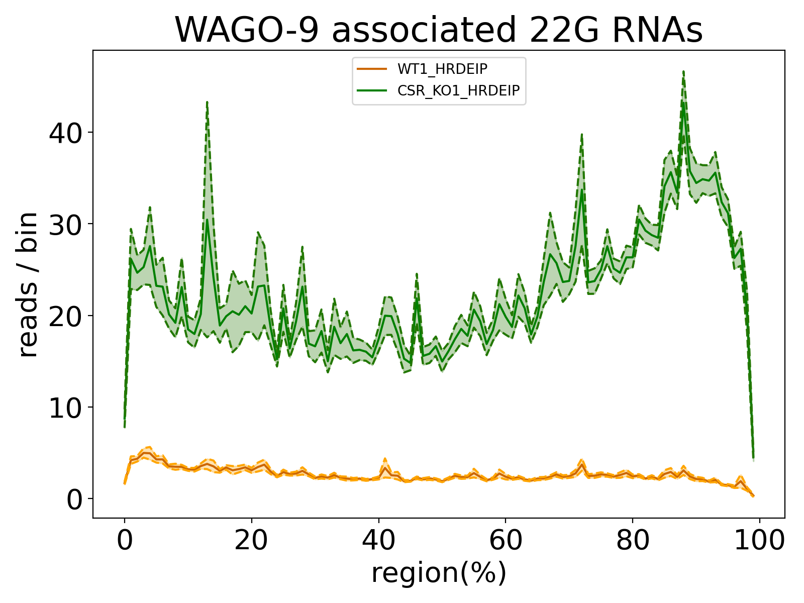
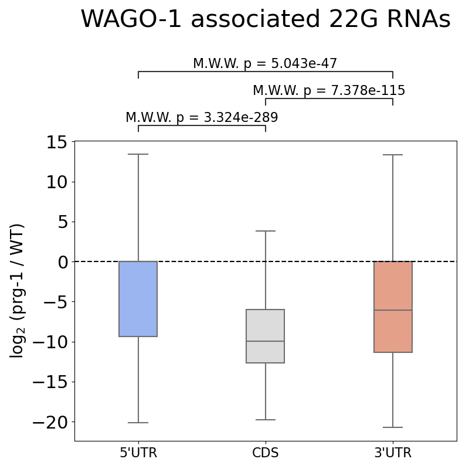

# Transcriptome Analysis Toolkit (TATK)

TATK is a toolkit to analyze transcriptome and plot result into multiple ways include: 

- Read counts or binding sites distribution in  three region such as 5'UTR, CDS, 3'UTR.


- Read counts or binding sites distribution near Start or Stop codons.


- Metagene distribution with customized numbers of bin. 


- Fold-change between wild-type and mutant RNAs.


For more information, please check original paper ["Transcriptome-wide analysis suggests piRNAs preferentially recognize the coding region of mRNAs in C. elegans, Wei-Sheng Wu, Jordan S. Brown, bioRxiv, 2022"](https://www.biorxiv.org/content/10.1101/2022.06.08.495319v1)

## Documentation

### General Usage
First, entering `bioinfo/piRNA_project/code/config/` and revising the configure files. 
Second, entering `bioinfo/piRNA_project/code/` and simply excuting 'run.py' as below:
```
$ python run.py
```
Figures will appear into `static/paper/'.

### Examples
Some configure of figures in the paper can be found in `examples/`.
To test them, simply excute the program 'plot.py' with the figure index as below:
```
$ python plot.py 4A1
```

### Requirements
- Python >= 3.6
- numpy >= 1.12.1
- seaborn >= 0.9,<0.12
- matplotlib >= 2.2.2
- pandas >= 0.23.0
- scipy >= 1.1.0
