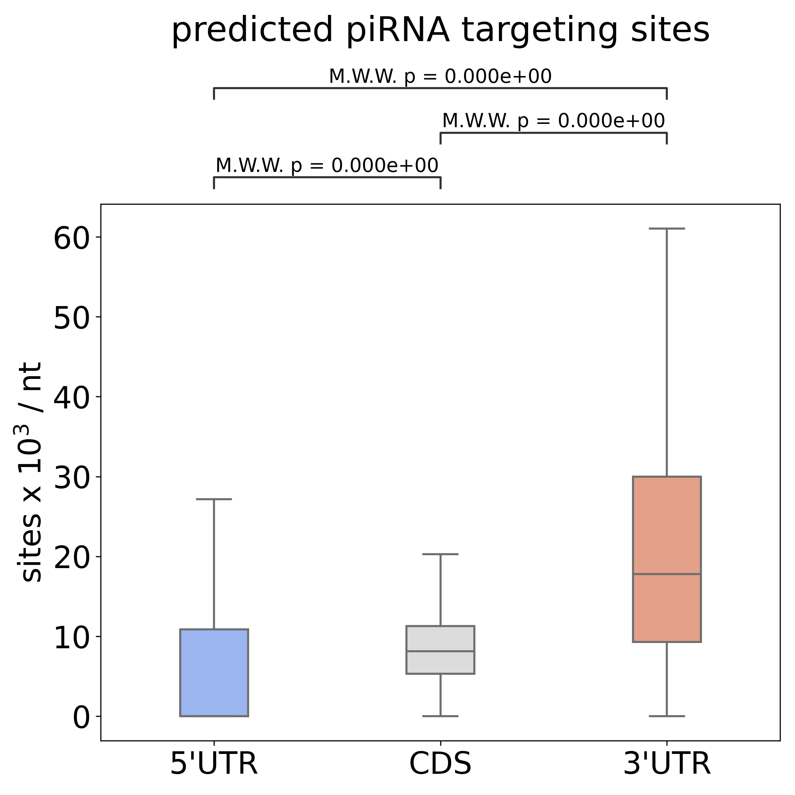

# TATK - Transcriptome Analysis Toolkit

TATK is a toolkit to analyze transcriptome and plot result into multiple ways include: 

> - Read counts or binding sites distribution in  three region (5'UTR, CDS, 3'UTR).
> 

> - Read counts or binding sites distribution near Start or Stop codons.
> 

> - Metagene distribution with customized datasets. 
> 

> - Fold-change between wild-type and mutant RNAs.
> 

For more information, please check original paper ["Transcriptome-wide analysis suggests piRNAs preferentially recognize the coding region of mRNAs in C. elegans, Wei-Sheng Wu, Jordan S. Brown, bioRxiv, 2022"](https://www.biorxiv.org/content/10.1101/2022.06.08.495319v1)

## Documentation

Please check wiki.

## Requirements
- Python >= 3.6
- numpy >= 1.12.1
- seaborn >= 0.9
- matplotlib >= 2.2.2
- pandas >= 0.23.0
- scipy >= 1.1.0
- python-pptx = 0.6
- PyYAML = 6.0
- statannot = 0.2.3
